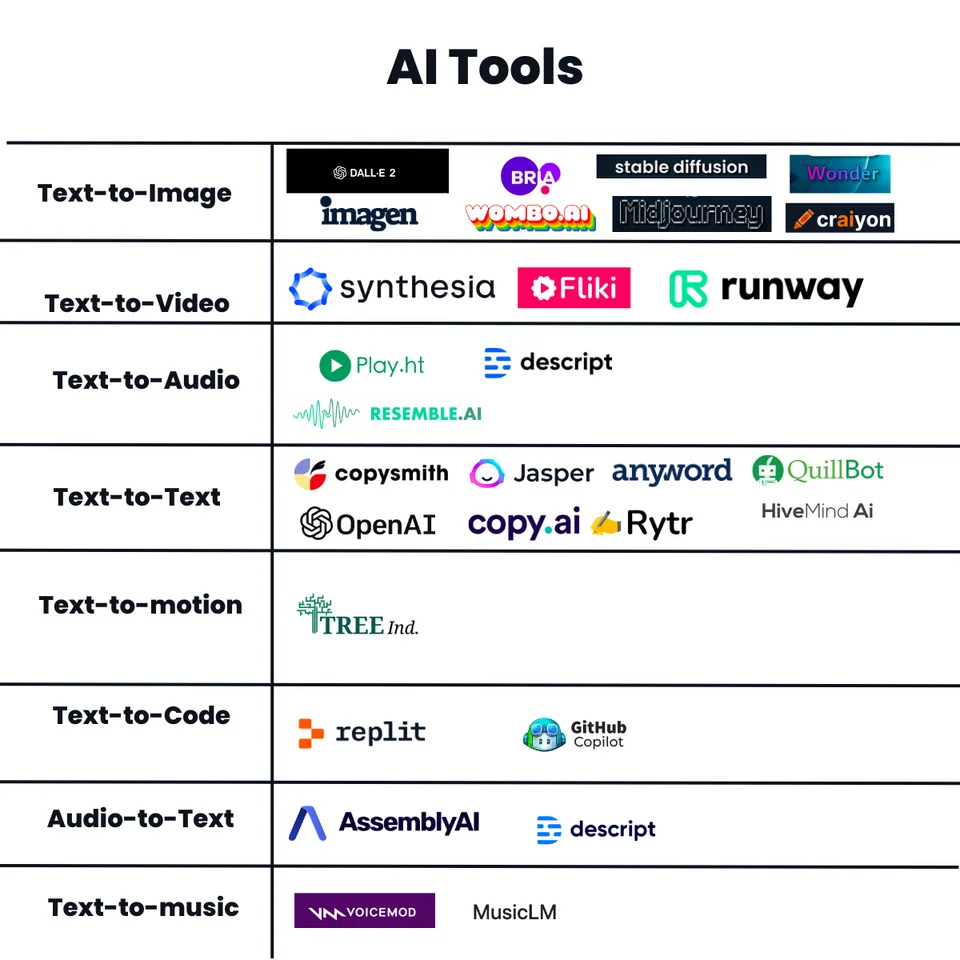

# OSINT

## **Intro**

The focus of this section is to provide helpful resources for OSINT and Passive reconnaissance on a given target. There will be certain tools and sites you might be familiar with that could be applicable in this section, that I have omitted and with good reason.

1. This section is "Passive" recon, which does not entail touching or interacting with your target in any way. For offensive operations, staying off radar is key. But can we check with other sources that may have already scanned out target? You bet.&#x20;
2. There are many research tools that provide similar output to the ones listed in the later sections. The ones that I have specifically omitted (and will document in another section) are tailored more to defensive operations and contain information like reputation data and historical activity.

## **OSINT Resources**

### OSINT Guides and Methodology

Specific for what you need to look for and how to find it, during the passive recon phase of a penetration test, or the proper way to OSINT.

* [IntelTechniques](https://inteltechniques.com/osintbook) - One of the best resources for OSINT has been Michael Bazzell's OSINT book and his website. I highly recommend you order his book. The HTML search tools I reference here come from his collection, available on his website for free. He also runs the Privacy and Security Podcast which is a highly recommended resource for both OSINT techniques and personal privacy.
* [https://ohshint.gitbook.io/](https://ohshint.gitbook.io/) - One of the most detailed OSINT resources available. Chocked full of search tools.
* [Security Sift ](http://www.securitysift.com/passive-reconnaissance/) - This write up is a great guide to Passive recon when preparing for a penetration test. For building up your own workflow, start with this.&#x20;
* [Pen Test Standard](http://www.pentest-standard.org/index.php/Intelligence\_Gathering) - Great guides for every step of a penetration test, but the recon section is especially useful as a reference here.&#x20;
* [OSINT\_Handbook\_2020.pdf](https://i-intelligence.eu/uploads/public-documents/OSINT\_Handbook\_2020.pdf) - OSINT Tools and Techniques by I-Intelligence
* [https://www.randhome.io/blog/2019/01/05/2019-osint-guide/](https://www.randhome.io/blog/2019/01/05/2019-osint-guide/) - Great guide of some newer tools and techniques.
* [https://nixintel.info/osint/using-gap-analysis-to-keep-osint-investigations-on-track/](https://nixintel.info/osint/using-gap-analysis-to-keep-osint-investigations-on-track/) - Great article on investigation methodology to hasten your OSINT research.
* Methodology of how to investigate a website - [https://twitter.com/aware\_online/status/1308312883248467975](https://twitter.com/aware\_online/status/1308312883248467975)
* [OSINT x UCCU Workshop on Open Source Intelligence](https://www.slideshare.net/miaoski/osint-x-uccu-workshop-on-open-source-intelligence)  - Slide deck from a workshop by Miaoski, one of the Senior Intel Analysts for Trend Micro.
* [102 Deep Dive in the Dark Web OSINT](https://www.youtube.com/watch?v=fzd3zkAI\_o4) - Great video presentation on Dark Web OSINT techniques
* [Verification handbook](https://datajournalism.com/read/handbook/verification-3) - Designed for journalists but still quite useful, the Verification handbook provides a wealth of resources on investigative procedure.

### Stu's People Search Workflow

### OSINT Training

Somewhat formal OSINT training courses.

* [https://courses.thecyberinst.org/courses/osint-challenge](https://courses.thecyberinst.org/courses/osint-challenge)
* [https://courses.thecyberinst.org/courses/osintmini](https://courses.thecyberinst.org/courses/osintmini)
* [https://www.tracelabs.org/initiatives/search-party](https://www.tracelabs.org/initiatives/search-party)
* [https://www.geoguessr.com/](https://www.geoguessr.com/)
* [https://kit.exposingtheinvisible.org/en/](https://kit.exposingtheinvisible.org/en/)
* [https://advocacyassembly.org/en/courses/](https://advocacyassembly.org/en/courses/)
*

CTFs

* [https://cyberdefenders.org/labs/38](https://cyberdefenders.org/labs/38) - Intel101
* [https://ctf.cybersoc.wales/](https://ctf.cybersoc.wales/)
* [https://www.geoguessr.com/](https://www.geoguessr.com/)
* [https://ictf.io/](https://ictf.io/)
* [https://hacktoria.com/](https://hacktoria.com/)
* [https://investigator.cybersoc.wales/](https://investigator.cybersoc.wales/)
* [https://tryhackme.com/room/ohsint](https://tryhackme.com/room/ohsint)
* [https://tryhackme.com/room/sakura](https://tryhackme.com/room/sakura)
* [https://tryhackme.com/room/searchlightosint](https://tryhackme.com/room/searchlightosint)
* [https://tryhackme.com/room/googledorking](https://tryhackme.com/room/googledorking)
* [https://tryhackme.com/room/geolocatingimages](https://tryhackme.com/room/geolocatingimages)
* [https://tryhackme.com/room/webosint](https://tryhackme.com/room/webosint)
* [https://sourcing.games/game-1/](https://sourcing.games/game-1/)

Youtube Channels and Web Casts

* 0x4rkØ OSINT videos - [https://www.youtube.com/c/0x4rk%C3%98/videos](https://www.youtube.com/c/0x4rk%C3%98/videos)
* OSINTCurious - [https://www.youtube.com/channel/UCjzceWf-OT3ImIKztzGkipA/videos](https://www.youtube.com/channel/UCjzceWf-OT3ImIKztzGkipA/videos)
  * OSINTCurious 10 minute tips - [https://www.youtube.com/playlist?list=PL423I\_gHbWUUOs09899rex4t2l5py9YIk](https://www.youtube.com/playlist?list=PL423I\_gHbWUUOs09899rex4t2l5py9YIk)
  * OSINTCurious Webcasts - [https://osintcurio.us/osintvideosandpodcasts/](https://osintcurio.us/osintvideosandpodcasts/)
* Adrian Crenshaw OSINT videos - [https://www.youtube.com/user/irongeek/search?query=OSINT](https://www.youtube.com/user/irongeek/search?query=OSINT)
* Authentic8 - [https://www.youtube.com/user/Authentic8TV](https://www.youtube.com/user/Authentic8TV)
* ConInt - [https://www.youtube.com/channel/UCBtSOceclpKcvunVNw82tFQ/videos](https://www.youtube.com/channel/UCBtSOceclpKcvunVNw82tFQ/videos)
* Toddington - Drop in and Learn - [https://www.youtube.com/channel/UCAqnnQkeSVTC3ZJ7urNiD8Q](https://www.youtube.com/channel/UCAqnnQkeSVTC3ZJ7urNiD8Q)
  * Drop in and Learn Web casts - [https://www.toddington.com/drop-in-and-learn-webcasts/](https://www.toddington.com/drop-in-and-learn-webcasts/)
* Using Kali OSINT Tools - [https://www.youtube.com/playlist?list=PL0A5SH4w3NaIBKahXMaO29uToGLn3dARF](https://www.youtube.com/playlist?list=PL0A5SH4w3NaIBKahXMaO29uToGLn3dARF)
* Ben Strick - OSINT at Home - [https://www.youtube.com/playlist?list=PLrFPX1Vfqk3ehZKSFeb9pVIHqxqrNW8Sy](https://www.youtube.com/playlist?list=PLrFPX1Vfqk3ehZKSFeb9pVIHqxqrNW8Sy)
* OSINT Dojo - [https://www.youtube.com/osintdojo](https://www.youtube.com/osintdojo)
* SCSP OSINT Series - [https://www.youtube.com/playlist?list=PL7yUP1guJz7fZNfZM-zkUieKSeA1TCG2S](https://www.youtube.com/playlist?list=PL7yUP1guJz7fZNfZM-zkUieKSeA1TCG2S)
* Tracelabs Youtube - [https://www.youtube.com/channel/UCezKbcbnYtrwRXfGzgQMI3w](https://www.youtube.com/channel/UCezKbcbnYtrwRXfGzgQMI3w)

### OSINT communities and thier resources

* [OSINTCurious](https://osintcurio.us/) - Great community and training for those who are interested in OSINT skills and tools.&#x20;
  * [Osint Curious OSINT Resource List](https://docs.google.com/document/d/14li22wAG2Wh2y0UhgBjbqEvZJCDsNZY8vpUAJ\_jJ5X8/edit)
* [OSINT Techniques Blog](https://www.osinttechniques.com/) - Fantastic site with tool lists, video guides, and blog on the latest techniques.
  * [osinttechniques.com Tool List](https://www.osinttechniques.com/osint-tools.html)
* [Osintion](https://www.theosintion.com/) - OSINT and Social Engineering master Joe Grey's website. Resources, OSINT Courses, and consultation services.
* [OSINT Dojo](https://www.osintdojo.com/) - A project that provides those new to OSINT a number of free resources and simple challenges that build on one another to provide a simple road map for learning more about the field and polishing up related skills while also earning badges to show off your hard work.
  * [OSINT Dojo Resources](https://www.osintdojo.com/resources/)
* [Bellingcat's OSINT How-To](https://www.bellingcat.com/category/resources/how-tos/) - Bellingcat is a collective of researchers and journalists that use OSINT tools and techniques for a variety of purposes and that have come together to share thier latest and greatest tools and techniques. They have a slow of guides for researching specific things with OSINT.
  * [Bellingcat's Tool Collection](https://docs.google.com/spreadsheets/d/18rtqh8EG2q1xBo2cLNyhIDuK9jrPGwYr9DI2UncoqJQ/edit#gid=930747607)
* [Aware-Online](https://www.aware-online.com/en/) - Aware Online is a Netherlands based training institute specialized in providing training in the field of Open Source intelligence (OSINT) and Social Media Intelligence (SOCMINT).
* [https://exposingtheinvisible.org/](https://exposingtheinvisible.org/) - Exposing the Invisible is a project of [Tactical Tech](https://tacticaltech.org/), an international NGO that engages with citizens and civil-society organizations to explore and mitigate the impacts of technology on society.
  * [https://kit.exposingtheinvisible.org/en/](https://kit.exposingtheinvisible.org/en/)

### OSINTer Blogs

All of these are fantastic resource. Check them regularly for new tools and techniques.

* [https://benjaminstrick.com/blog/](https://benjaminstrick.com/blog/)
* [https://blog.bushidotoken.net/](https://blog.bushidotoken.net/)
* [https://threadreaderapp.com/user/cyb\_detective](https://threadreaderapp.com/user/cyb\_detective)
* [https://dutchosintguy.com/events-and-blogs/](https://dutchosintguy.com/events-and-blogs/)
* [https://www.intelligencewithsteve.com/blog](https://www.intelligencewithsteve.com/blog)
* [https://inteltechniques.com/blog/](https://inteltechniques.com/blog/)
* [https://keyfindings.blog/](https://keyfindings.blog/)
* [https://www.lorandbodo.com/](https://www.lorandbodo.com/)
* [https://www.offensiveosint.io/](https://www.offensiveosint.io/)
* [https://www.osintcombine.com/blog](https://www.osintcombine.com/blog)
* [https://www.osinteditor.com/](https://www.osinteditor.com/)
* [https://www.osintme.com/](https://www.osintme.com/)
* [http://www.theosintjournal.org/](http://www.theosintjournal.org/)
* [https://www.bellingcat.com/](https://www.bellingcat.com/)
* [https://www.cqcore.uk/blog-posts/](https://www.cqcore.uk/blog-posts/)
* [https://keyfindings.blog/](https://keyfindings.blog/)
* [https://www.offensiveosint.io/](https://www.offensiveosint.io/)
* [https://sector035.nl/](https://sector035.nl/)

### **Forums**

* [https://app.element.io/#/room/#osint-chat:matrix.org](https://app.element.io/#/room/#osint-chat:matrix.org)
* [https://osint.team/home](https://osint.team/home)
* [https://www.websleuths.com/forums/](https://www.websleuths.com/forums/)
* https://reddit.com
  * r/InfoSecNews
  * r/OSINT
  * r/RBI

### Discord/Slack

* Bellingcat Discord - [https://discord.gg/nTaNPmz](https://discord.gg/nTaNPmz)
* conInt Discord - [https://discord.gg/AJYUV7S](https://discord.gg/AJYUV7S)
* Defcon Discord - [https://discord.gg.defcon](https://discord.gg.defcon)
* Hack South Discord - [https://discord.gg/nTJFJrUwwT](https://discord.gg/nTJFJrUwwT)
* Imaginary CTF Discord - [https://discord.gg/sjVcTTXg6a](https://discord.gg/sjVcTTXg6a)
* OSINT Editor Discord - [https://discord.gg/M5pk9rE](https://discord.gg/M5pk9rE)
* OSINT-FR Discord - [https://discord.osintfr.com](https://discord.osintfr.com)
* Project Owl Discord - [https://discord.gg/projectowl](https://discord.gg/projectowl)
* SANS Blue Team Discord - [https://discord.gg/ZvgwPtuusE](https://discord.gg/ZvgwPtuusE)
* DeadpixelSec Discord - [https://discord.gg/infosec](https://discord.gg/infosec)
* OSINT Curious Discord - [https://discord.gg/eaz5AqHDfK](https://discord.gg/eaz5AqHDfK)
* OSINTion Discord - [https://discord.gg/p78TTGa](https://discord.gg/p78TTGa)
* Tracelabs Slack - [https://tracelabs.slack.com](https://tracelabs.slack.com)

### Volunteer OSINT

There are a few interesting organizations out there that take OSINT researchers and have them help with certain public good tasks like finding missing children or stopping pedophiles. It can be a heavy ask but can really do some good in the world with the skills that we have. Please check out and If you can donate some time to help, please do!

* [https://www.tracelabs.org/](https://www.tracelabs.org/)&#x20;
* [https://www.innocentlivesfoundation.org/](https://www.innocentlivesfoundation.org/)
* [https://badassarmy.org/](https://badassarmy.org/)
* [https://citizenevidence.org/](https://citizenevidence.org/)
* [https://crisismapping.ning.com/](https://crisismapping.ning.com/)
* [https://www.fbi.gov/wanted/ecap](https://www.fbi.gov/wanted/ecap)
* [https://informnapalm.org/en/](https://informnapalm.org/en/)
* [https://locate.international/](https://locate.international/)
* [https://www.missingkids.org/](https://www.missingkids.org/)
* [https://www.ncptf.org/](https://www.ncptf.org/)
* [https://ourrescue.org/](https://ourrescue.org/)
* [https://www.europol.europa.eu/stopchildabuse](https://www.europol.europa.eu/stopchildabuse)
* [https://www.stopthetraffik.org/](https://www.stopthetraffik.org/)

## OSINT Tools

### OSINT Tool and Resource Collections.&#x20;

These are misc tools and collections out there. Many overlap, but there are fantastic things in each.

* [Awesome Collection: OSINT](https://github.com/jivoi/awesome-osint)&#x20;
* [https://start.me/p/DPYPMz/the-ultimate-osint-collection](https://start.me/p/DPYPMz/the-ultimate-osint-collection)
* [https://www.aware-online.com/en/osint-tools/](https://www.aware-online.com/en/osint-tools/)
* [OSINT Framework](https://osintframework.com/)&#x20;
* [OpenOSINT Team Tools](https://github.com/IVMachiavelli/OSINT\_Team\_Links)
* [Sector035 OSINT Links](https://sector035.nl/links)
* [Technisette OSINT Links](https://www.technisette.com/p/tools)
* [Trouble Fake - start.me](https://start.me/p/QRQb0O/trouble-fake)&#x20;
* [5nacks OSINT Bookmarks](https://github.com/5nacks/OSINTBookmarks)
* [OSINT Combine Bookmarks](https://www.osintcombine.com/osint-bookmarks)
* [Andy Black and Associates OSINT Toolkit](https://www.andyblackassociates.co.uk/resources-andy-black-associates/osint-toolkit/)
* [Palliscope OSINT Bookmarks](https://www.paliscope.com/2020/11/04/200-of-our-best-osint-investigation-tools-free-download/)
* [OSINT Stuff's Pile of OSINT links](https://cipher387.github.io/osint\_stuff\_tool\_collection/)
* [Terrorism & Radicalisation Research Dashboard - start.me](https://start.me/p/OmExgb/terrorism-radicalisation-research-dashboard)****
* [OSINT\_Encyclopedia](https://github.com/optiv/OSINT\_Encyclopedia)
* [https://start.me/p/rxeRqr/aml-toolbox](https://start.me/p/rxeRqr/aml-toolbox)
* [https://www.aware-online.com/en/osint-tools/](https://www.aware-online.com/en/osint-tools/)
* [https://start.me/p/rxRbpo/ti?locale=en](https://start.me/p/rxRbpo/ti?locale=en)
* [https://start.me/p/W1AXYo/toolkit](https://start.me/p/W1AXYo/toolkit)
* [https://start.me/p/ZME8nR/osint](https://start.me/p/ZME8nR/osint)
* [https://www.osinttechniques.com/osint-tools.html](https://www.osinttechniques.com/osint-tools.html)
* [https://start.me/p/4K0DXg/social-media](https://start.me/p/4K0DXg/social-media)
* [https://thecyberpost.com/open-source-intelligence-osint-tools/](https://thecyberpost.com/open-source-intelligence-osint-tools/)
* [https://start.me/p/ZGAzN7/verification-toolset](https://start.me/p/ZGAzN7/verification-toolset)
* [https://map.malfrats.industries/](https://map.malfrats.industries/)
* [https://github.com/cipher387/API-s-for-OSINT](https://github.com/cipher387/API-s-for-OSINT)
* [https://github.com/cipher387/osint\_stuff\_tool\_collection](https://github.com/cipher387/osint\_stuff\_tool\_collection)

### VMs

* [https://www.tracelabs.org/initiatives/osint-vm](https://www.tracelabs.org/initiatives/osint-vm) - specialized OSINT VM specifically to bring together the most effective OSINT tools and customized scripts
* [https://tsurugi-linux.org/](https://tsurugi-linux.org/) - 64 bit Linux version to perform digital forensics analysis and OSINT research.
  * [https://tsurugi-linux.org/documentation\_tsurugi\_linux\_tools\_listing\_2021.php](https://tsurugi-linux.org/documentation\_tsurugi\_linux\_tools\_listing\_2021.php)

### Frameworks

* [https://nitinpandey.in/ihunt/#](https://nitinpandey.in/ihunt/)  - Detailed OSINT framework with dozens of tools grouped by purpose.
* [osrframework](https://www.kali.org/tools/osrframework/) - This package contains a set of libraries developed by i3visio to perform Open Source Intelligence tasks. They include references to a bunch of different applications related to username checking, DNS lookups, information leaks research, deep web search, regular expressions extraction and many others.
* [Scrummage](https://github.com/matamorphosis/Scrummage) — Ultimate OSINT and Threat Hunting Framework
* [Mr.Holmes](https://github.com/Lucksi/Mr.Holmes) — osint toolkit for gathering information about domains, phone numbers and social media accounts


[recon-frameworks.md](../../red-offensive/offensive-toolbox/recon-frameworks.md)


### Tools by Category


[search-engines](search-engines/)



[cyber-search.md](cyber-search.md)



[dark-web-search.md](dark-web-search.md)



[ip-address.md](ip-address.md)



[domain.md](domain.md)



[username-email.md](username-email.md)



[name-phone-gov-record.md](name-phone-gov-record.md)



[socmint-social-media.md](socmint-social-media.md)



[files-media-breach-paste-code.md](files-media-breach-paste-code.md)



[misc-osint.md](misc-osint.md)

