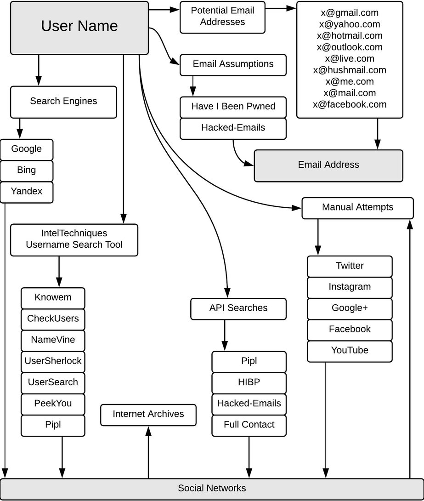

# Username/Email

## Usernames and Email Addresses

Corporate usernames are beginning to be obnoxiously easy to guess and build. The standard of FIRSTNAME.LASTNAME@CORP.com is so common, it's ridiculous. Even more so when account management tools will simply take the first half of the email and reuse it as a username. We can use schemes like this to our advantage to search for a multitude of treasures like accounts on other services with the same username, credentials found in breaches, and associated sites or tools. When searching for usernames, you can uncover linked social media accounts and tons of relevant intelligence.

## Username and Email Address Analysis Tools

**Username.html and Email.html**

These two tools often go hand in hand with results often overlapping. Still, it is good habit to run the searches for both the username and the email address in case there is a discrepancy between the two. These two tools check for two things: presence of the username/email on a given platform, and any public/leaked info connected to them.





Username Search Tools

* [https://whatsmyname.app/](https://whatsmyname.app/) - This tool allows you to enumerate usernames across many different websites.
  * [https://github.com/WebBreacher/WhatsMyName](https://github.com/WebBreacher/WhatsMyName)
* [https://usersearch.org/](https://usersearch.org/index.php?amp=1) - Search Engine for Usernames
* [Lullar search](https://www.lullar.com/) - Search tool specifically for names
* [Name Check](https://namechk.com/) - See if a username is available across multiple platforms
* [Sherlock ](https://github.com/sherlock-project/sherlock)- Hunt down social media accounts by username across [social networks](https://github.com/sherlock-project/sherlock/blob/master/sites.md)
  * [https://www.kali.org/tools/sherlock/](https://www.kali.org/tools/sherlock/)
* [Stalker](https://gitlab.com/Pxmme/stalker) - OSINT tool for automated scanning of social networks and other websites, using a single nickname.
* [finduser](https://github.com/xHak9x/finduser) - Find usernames across over 75 social networks
* [socialscan](https://github.com/iojw/socialscan) - Python library and CLI for accurately querying username and email usage on online platforms.
* [https://analyzeid.com/username/](https://analyzeid.com/username/) - Social media username checker. Gather information on the taken username and get a summary of who the person is.
* [https://www.idcrawl.com/](https://www.idcrawl.com/) - A free people search engine that organizes social network information, deep web information, phone numbers, email addresses and more.
* [https://knowem.com/](https://knowem.com/) - Allows you to check for a username or real name instantly on over 500 popular and emerging social media sites.
* [https://www.user-searcher.com](https://www.user-searcher.com) - A free OSINT tool to search username in 2000+ websites, including social networks, dating sites, crypto forums, etc.

Email Address Search Tools

* [Public Mail Records](https://publicemailrecords.com/) - Search public email records for a given email address.
* [MXToolBox](https://mxtoolbox.com/) - Collection of online tools that can gather multiple points of data surrounding an email address or domain.
* [https://seon.io/intelligence-tool/#email-analysis-module](https://seon.io/intelligence-tool/#email-analysis-module) - Enrich user data based on a single email address.
* [https://tools.epieos.com/email.php](https://tools.epieos.com/email.php) - Enter an email address and see which sites the email address has been used.&#x20;
  * [https://github.com/megadose/holehe](https://github.com/megadose/holehe)
* [https://emailcrawlr.com/](https://emailcrawlr.com/) - Search EmailCrawlr for email addresses and phone numbers associated with a domain.

Email Address Enumeration Tools

For when you have your target but not their email address

* [https://hunter.io/](https://hunter.io/) - Discover email addresses by company name
* [https://phonebook.cz/](https://phonebook.cz/) - Phonebook lists all domains, email addresses, or URLs for the given input domain.
* [https://www.voilanorbert.com/](https://www.voilanorbert.com/) - Discover email addresses by company name
* [https://connect.clearbit.com/](https://connect.clearbit.com/) - Powerful email discovery tool, only works in chrome.
* [Email Format ](https://www.email-format.com/)- Find the email address format for a given company or domain.
* [https://snov.io/email-finder](https://snov.io/email-finder) - Locate employee email addresses via domain name. Very handy.

Email Verification Tools

Some times it helps to perform a quick check to see if an email is even valid or registered.

* [Tru Mail](https://trumail.io/) - Prevent bounced emails and low-quality users with free professional grade email verification
* [Email Hippo](https://tools.verifyemailaddress.io/) - Email address verification technology from Email Hippo that connects to mailboxes and checks whether an email address exists.
* [Verify email](https://verify-email.org/) - This email verification tool actually connects to the mail server and checks whether the mailbox exists or not.
* [Email Checker](https://www.emailchecker.com/) - Email Checker ensures that an email address is correct and active in real-time without ever needing to send a message.

CLI Email Intelligence Tools

* [TheHarvester](https://github.com/laramies/theharvester) - This tool is the defacto standard for email intelligence gathering. It checks a large array of sources to pull together information. It can leverage APIs of other services such as Spyse or Shodan to improve the search. Remember these will require an API key to use. I have found that between the above html tools and this, it will satisfy your email searching needs.
* [Infoga](https://github.com/m4ll0k/Infoga) - Infoga is a tool gathering email accounts information (ip,hostname,country,...) from different public source (search engines, pgp key servers and shodan) and check if emails was leaked using haveibeenpwned.com API.
* [Match Email to Phone number ](https://github.com/martinvigo/email2phonenumber)- email2phonenumber is an OSINT tool that allows you to obtain a target's phone number just by having his email address.
* [GHunt ](https://github.com/mxrch/GHunt)- Google account info scraper
* [h8mail](https://github.com/khast3x/h8mail/) - Email OSINT & Password breach hunting tool, locally or using premium services. Supports chasing down related email
  * [https://hakin9.org/h8mail-email-osint-password-breach-hunting-tool-locally-or-using-premium-services/](https://hakin9.org/h8mail-email-osint-password-breach-hunting-tool-locally-or-using-premium-services/)
* [EmailFinder](https://github.com/Josue87/EmailFinder) - Search emails from a domain through search engines

****



## Investigation MindMaps

.png>)
