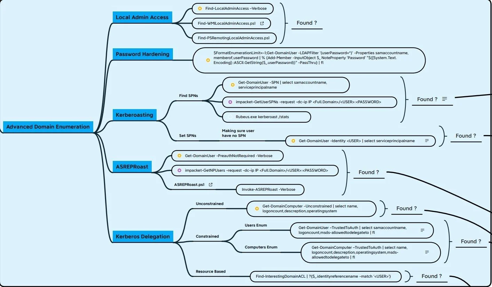

# Yellow - AI, Machine Learning, and FOSS

Use this page for AI/ML learning, security research datasets, and free/open source software references. Keep detection engineering in Blue, lab building in Training, and operational tooling in the relevant Red/Blue/DFIR sections.

## AI Tools

<figure><figcaption></figcaption></figure>

### AI Tool Collections

* [There's An AI For That](https://theresanaiforthat.com/) - Broad AI tool catalog.
* [Futurepedia](https://www.futurepedia.io/) - AI tool directory.
* [AI Shrine](https://www.aishrine.com/) - AI resource index.

### Interesting AI Articles

* [Should we be worried about malicious use of AI language models?](https://www.computerweekly.com/news/252529081/Should-we-be-worried-about-malicious-use-of-AI-language-models)
* [ChatGPT in schools and universities](https://apnews.com/article/technology-education-colleges-and-universities-france-a0ab654549de387316404a7be019116b)

### Prompt Crafting

* [prmpts.carrd.co](https://prmpts.carrd.co/)

## FOSS - Free and Open Source Software

* [Open Source Alternative To](https://www.opensourcealternative.to/) - Directory of open source alternatives to commercial tools.

## Machine Learning for Security

### Research Data

Good ML research starts with reliable data. Security datasets can also be useful for detection engineering, packet analysis, malware analysis, and training labs.

* [Awesome Cybersecurity Datasets](https://github.com/shramos/Awesome-Cybersecurity-Datasets) - Awesome list; duplicate is allowed under the guide's Awesome List exception.
* [VizSec research datasets](https://vizsec.org/data/)
* [Splunk Security Dataset](https://live.splunk.com/splunk-security-dataset-project)
* [OTRF Security Datasets](https://github.com/OTRF/Security-Datasets)
* [SecRepo](https://www.secrepo.com/) - Security data samples.
* [PCAP-ATTACK](https://github.com/sbousseaden/PCAP-ATTACK) - PCAP samples for post-exploitation techniques.
* [EVTX-ATTACK-SAMPLES](https://github.com/sbousseaden/EVTX-ATTACK-SAMPLES) - Windows event attack samples.
* [Public PCAP files for download](https://www.netresec.com/?page=PcapFiles)
* [Splunk Boss of the SOC v3 dataset](https://github.com/splunk/botsv3)
* [PhishingKitTracker](https://github.com/marcoramilli/PhishingKitTracker) - Phishing kit samples for security research.

Practice labs and generated SOC datasets are maintained in Training and Blue Defense.


[practice-lab.md](training/practice-lab.md)



[detection-use-cases](blue-defense/event-detection/detection-use-cases/)


### Detection and Analytics References

* [MITRE CAR](https://car.mitre.org/) - MITRE Cyber Analytics Repository. CAR has seen limited updates compared with newer ATT&CK-adjacent projects, so treat it as a useful reference rather than a complete current coverage map.
* [soc-faker](https://github.com/swimlane/soc-faker) - Generates fake SOC and security automation data.
* [Awesome Network Analysis](https://github.com/briatte/awesome-network-analysis#readme)
* [Incremental Machine Learning by Example: Zeek, River, and JA3](https://research.nccgroup.com/2021/06/14/incremental-machine-leaning-by-example-detecting-suspicious-activity-with-zeek-data-streams-river-and-ja3-hashes/)
* [Applying Machine Learning to Network Anomalies](https://www.youtube.com/watch?v=qOfgNd-qijI)
* [Machine Learning Techniques for Intrusion Detection](https://www.sans.org/reading-room/whitepapers/detection/machine-learning-techniques-intrusion-detection-40330)
* [IT Security From The Eyes Of Data Scientists](https://www.darkreading.com/it-security-from-the-eyes-of-data-scientists/d/d-id/1140831) - Historical context.
* [How Enterprises Can Use Big Data To Improve Security](https://www.darkreading.com/how-enterprises-can-use-big-data-to-improve-security/d/d-id/1140059) - Historical context.

## Machine Learning Books

Machine Learning Books

* [A Brief Introduction to Machine Learning for Engineers](https://arxiv.org/pdf/1709.02840.pdf) - Osvaldo Simeone.
* [A Brief Introduction to Neural Networks](http://www.dkriesel.com/en/science/neural_networks)
* [A Comprehensive Guide to Machine Learning](https://www.eecs189.org/static/resources/comprehensive-guide.pdf) - Soroush Nasiriany, Garrett Thomas, William Wang, Alex Yang.
* [A Course in Machine Learning](http://ciml.info/dl/v0_9/ciml-v0_9-all.pdf)
* [A First Encounter with Machine Learning](https://www.ics.uci.edu/~welling/teaching/ICS273Afall11/IntroMLBook.pdf)
* [A Selective Overview of Deep Learning](https://arxiv.org/abs/1904.05526) - Fan, Ma, and Zhong.
* [Algorithms for Reinforcement Learning](https://sites.ualberta.ca/~szepesva/papers/RLAlgsInMDPs.pdf) - Csaba Szepesvari.
* [An Introduction to Statistical Learning](http://www-bcf.usc.edu/~gareth/ISL/) - Gareth James, Daniela Witten, Trevor Hastie, and Robert Tibshirani.
* [Bayesian Reasoning and Machine Learning](http://web4.cs.ucl.ac.uk/staff/D.Barber/pmwiki/pmwiki.php?n=Brml.HomePage)
* [Deep Learning](http://www.deeplearningbook.org) - Ian Goodfellow, Yoshua Bengio, and Aaron Courville.
* [Deep Learning for Coders with fastai and PyTorch](https://github.com/fastai/fastbook)
* [Deep Learning with PyTorch](https://pytorch.org/assets/deep-learning/Deep-Learning-with-PyTorch.pdf)
* [Dive into Deep Learning](http://d2l.ai)
* [Explorations in Parallel Distributed Processing](https://web.stanford.edu/group/pdplab/pdphandbook)
* [Foundations of Machine Learning, Second Edition](https://mitpress.ublish.com/ereader/7093/?preview=#page/Cover)
* [Free and Open Machine Learning](https://freeandopenmachinelearning.readthedocs.io/en/latest/index.html)
* [Gaussian Processes for Machine Learning](http://www.gaussianprocess.org/gpml/)
* [IBM Machine Learning for Dummies](https://www.ibm.com/downloads/cas/GB8ZMQZ3)
* [Information Theory, Inference, and Learning Algorithms](http://www.inference.phy.cam.ac.uk/itila/)
* [Interpretable Machine Learning](https://christophm.github.io/interpretable-ml-book/)
* [Introduction to CNTK Succinctly](https://www.syncfusion.com/ebooks/cntk_succinctly)
* [Introduction to Machine Learning](http://arxiv.org/abs/0904.3664v1)
* [Keras Succinctly](https://www.syncfusion.com/ebooks/keras-succinctly)
* [Learn Tensorflow](https://bitbucket.org/hrojas/learn-tensorflow)
* [Learning Deep Architectures for AI](https://mila.quebec/wp-content/uploads/2019/08/TR1312.pdf)
* [Machine Learning](http://www.intechopen.com/books/machine_learning)
* [Machine Learning for Data Streams](https://moa.cms.waikato.ac.nz/book-html/)
* [Machine Learning from Scratch](https://dafriedman97.github.io/mlbook/content/introduction.html)
* [Machine Learning, Neural and Statistical Classification](http://www1.maths.leeds.ac.uk/~charles/statlog/)
* [Mathematics for Machine Learning](https://gwthomas.github.io/docs/math4ml.pdf) - Garrett Thomas.
* [Mathematics for Machine Learning](https://mml-book.github.io) - Marc Peter Deisenroth, A Aldo Faisal, and Cheng Soon Ong.
* [Neural Networks and Deep Learning](http://neuralnetworksanddeeplearning.com)
* [Probabilistic Models in the Study of Language](http://idiom.ucsd.edu/~rlevy/pmsl_textbook/text.html)
* [Python Machine Learning Projects](https://www.digitalocean.com/community/books/python-machine-learning-projects-a-digitalocean-ebook)
* [Reinforcement Learning: An Introduction](http://incompleteideas.net/book/RLbook2020.pdf)
* [Speech and Language Processing, 3rd Edition Draft](https://web.stanford.edu/~jurafsky/slp3/ed3book.pdf)
* [The Elements of Statistical Learning](https://web.stanford.edu/~hastie/ElemStatLearn/)
* [The LION Way: Machine Learning plus Intelligent Optimization](https://intelligent-optimization.org/LIONbook/lionbook_3v0.pdf)
* [Top 10 Machine Learning Algorithms Every Engineer Should Know](https://www.dezyre.com/article/top-10-machine-learning-algorithms/202)
* [Understanding Machine Learning: From Theory to Algorithms](https://www.cs.huji.ac.il/~shais/UnderstandingMachineLearning)

