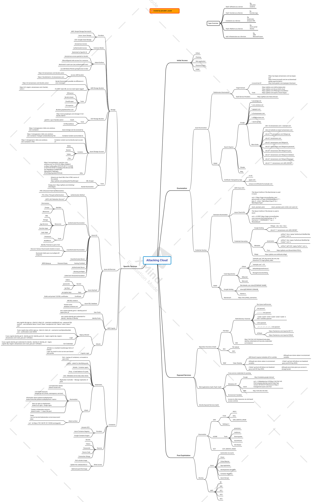

# Cloud

## **General Cloud**

### Cloud Basics and design

* [Cloud Computing for Science and Engineering](https://cloud4scieng.org/chapters/) - Ian Foster, Dennis B. Gannon (🚧 _in process_)
* [Cloud Design Patterns](https://docs.microsoft.com/en-us/azure/architecture/patterns/)
* [Designing Distributed Systems](https://azure.microsoft.com/en-us/resources/designing-distributed-systems/) _(account required)_
* [Multi-tenant Applications for the Cloud, 3rd Edition](http://www.microsoft.com/en-us/download/details.aspx?id=29263)

### Cloud Security and Hardening

* [SANS Cloud Security Checklist](https://www.sans.org/cloud-security/securing-web-application-technologies/?msc=cloud-security-lp) - Best practices and references for hardening your cloud infrastructure.
* [https://cloudsecdocs.com/](https://cloudsecdocs.com/) - Great page with tons of detail on cloud and container security
* [https://cloudsecwiki.com/](https://cloudsecwiki.com/) - Handy page with a few resources and hardening tips for cloud deployments.
* [https://medium.com/mitre-engenuity/research-partnership-matures-att-ck-for-cloud-d232998968ce](https://medium.com/mitre-engenuity/research-partnership-matures-att-ck-for-cloud-d232998968ce)

### Cloud Pen Testing

* [https://github.com/CyberSecurityUP/Awesome-Cloud-PenTest](https://github.com/CyberSecurityUP/Awesome-Cloud-PenTest) - Huge collection of different offensive cloud tools and resources.
* [https://hackingthe.cloud/](https://hackingthe.cloud/) - Solid resource for cloud pentesting methodology and tooling.
* [https://github.com/dafthack/CloudPentestCheatsheets](https://github.com/dafthack/CloudPentestCheatsheets) - This repository contains a collection of cheatsheets I have put together for tools related to pentesting organizations that leverage cloud providers.
* _Hacking: The next generation - Cloud Insecurity: Sharing the cloud with your enemy, pg. 121_

### Multi-Cloud Tools

* Enumeration and Auditing
  * [cloud-enum](https://www.kali.org/tools/cloud-enum/) - enumerates public resources matching user requested keywords in public clouds
  * [ScoutSuite](https://github.com/nccgroup/ScoutSuite) - Scout Suite is an open source multi-cloud security-auditing tool, which enables security posture assessment of cloud environments. Using the APIs exposed by cloud providers, Scout Suite gathers configuration data for manual inspection and highlights risk areas. Rather than going through dozens of pages on the web consoles, Scout Suite presents a clear view of the attack surface automatically.
    * [https://www.youtube.com/watch?v=k8CQhvQAu7E](https://www.youtube.com/watch?v=k8CQhvQAu7E)
  * [SkyArk](https://github.com/cyberark/SkyArk) - SkyArk helps to discover, assess and secure the most privileged entities in Azure and AWS
  * [PMapper](https://github.com/nccgroup/PMapper) - Principal Mapper (PMapper) is a script and library for identifying risks in the configuration of AWS Identity and Access Management (IAM) for an AWS account or an AWS organization. It models the different IAM Users and Roles in an account as a directed graph, which enables checks for privilege escalation and for alternate paths an attacker could take to gain access to a resource or action in AWS.
  * [gitoops](https://github.com/ovotech/gitoops) - GitOops is a tool to help attackers and defenders identify lateral movement and privilege escalation paths in GitHub organizations by abusing CI/CD pipelines and GitHub access controls.
  * [cloudbrute](https://www.kali.org/tools/cloudbrute/) - This package contains a tool to find a company (target) infrastructure, files, and apps on the top cloud providers
    * [https://0xsha.io/posts/introducing-cloudbrute-wild-hunt-on-the-clouds](https://0xsha.io/posts/introducing-cloudbrute-wild-hunt-on-the-clouds)
* Offensive Frameworks
  * [ cloudsploit](https://github.com/aquasecurity/cloudsploit) - CloudSploit by Aqua is an open-source project designed to allow detection of security risks in cloud infrastructure accounts, including: Amazon Web Services (AWS), Microsoft Azure, Google Cloud Platform (GCP), Oracle Cloud Infrastructure (OCI), and GitHub. These scripts are designed to return a series of potential misconfigurations and security risks.
  * [serverless-prey](https://github.com/pumasecurity/serverless-prey) - Serverless Prey is a collection of serverless functions (FaaS), that, once launched to a cloud environment and invoked, establish a TCP reverse shell, enabling the user to introspect the underlying container:
    * [Panther](https://github.com/pumasecurity/serverless-prey/blob/main/panther): AWS Lambda written in Node.js
    * [Cougar](https://github.com/pumasecurity/serverless-prey/blob/main/cougar): Azure Function written in C#
    * [Cheetah](https://github.com/pumasecurity/serverless-prey/blob/main/cheetah): Google Cloud Function written in Go

### General Cloud Training Resources

* [https://cloudacademy.com/](https://cloudacademy.com/)

## **Azure and O365 -** The Microsoft Cloud Environment

### Basics

* Reference Docs
  * [https://github.com/MicrosoftDocs/azure-docs](https://github.com/MicrosoftDocs/azure-docs)
  * [https://www.microsoft.com/en-us/msrc/pentest-rules-of-engagement](https://www.microsoft.com/en-us/msrc/pentest-rules-of-engagement) - Azure Pentesting Rules of Engagement
  * [https://azurerange.azurewebsites.net/](https://azurerange.azurewebsites.net/) - Azure IP Ranges
  * &#x20;[https://www.cloudconformity.com/knowledge-base/azure/](https://www.cloudconformity.com/knowledge-base/azure/) - Azure Best Practices
  * [https://docs.microsoft.com/en-us/security/benchmark/azure/v2-cis-benchmark](https://docs.microsoft.com/en-us/security/benchmark/azure/v2-cis-benchmark)
  * [https://github.com/AzureAD/Deployment-Plans](https://github.com/AzureAD/Deployment-Plans)
  * [https://attack.mitre.org/matrices/enterprise/cloud/azuread/](https://attack.mitre.org/matrices/enterprise/cloud/azuread/)
  * [https://attack.mitre.org/matrices/enterprise/cloud/office365/](https://attack.mitre.org/matrices/enterprise/cloud/office365/)
  * [https://github.com/reprise99](https://github.com/reprise99)
* Resource Collections
  * [https://github.com/kmcquade/awesome-azure-security](https://github.com/kmcquade/awesome-azure-security)
  * [https://github.com/Azure/Azure-Network-Security](https://github.com/Azure/Azure-Network-Security)
* Azure Vulnerabilities
  * [https://rhinosecuritylabs.com/cloud-security/common-azure-security-vulnerabilities/](https://rhinosecuritylabs.com/cloud-security/common-azure-security-vulnerabilities/)
  * [Azure Security Vulnerabilities and Pentesting | Rhino Security Labs](https://rhinosecuritylabs.com/cloud-security/common-azure-security-vulnerabilities/)&#x20;
  * [Top 20 Microsoft Azure Vulnerabilities and Misconfigurations - InfosecMatter](https://www.infosecmatter.com/top-20-microsoft-azure-vulnerabilities-and-misconfigurations/)&#x20;
* Azure Tasks
  * [https://docs.microsoft.com/en-us/microsoft-365/compliance/search-the-audit-log-in-security-and-compliance?view=o365-worldwide#search-the-audit-log](https://docs.microsoft.com/en-us/microsoft-365/compliance/search-the-audit-log-in-security-and-compliance?view=o365-worldwide#search-the-audit-log)
  * [https://gcits.com/knowledge-base/enabling-unified-audit-log-delegated-office-365-tenants-via-powershell/](https://gcits.com/knowledge-base/enabling-unified-audit-log-delegated-office-365-tenants-via-powershell/)
  * [https://docs.microsoft.com/en-us/office/office-365-management-api/office-365-management-activity-api-schema#auditlogrecordtype](https://docs.microsoft.com/en-us/office/office-365-management-api/office-365-management-activity-api-schema#auditlogrecordtype)
  * [https://www.codetwo.com/admins-blog/how-to-export-office-365-mailboxes-to-pst-using-ediscovery/](https://www.codetwo.com/admins-blog/how-to-export-office-365-mailboxes-to-pst-using-ediscovery/)
* [The basics of modern authentication - Microsoft identity platform](https://www.youtube.com/watch?v=tkQJSHFsduY)
* [Unified Audit logs in Microsoft 365](https://www.youtube.com/watch?v=c1kId\_esv0k)

### Azure Training

* [The Developer’s Guide to Azure](https://azure.microsoft.com/en-us/campaigns/developer-guide/) - Great free traing from Microsoft
* [Awesome Azure Learning](https://github.com/ddneves/awesome-azure-learning): numerous references for Azure learning, especially for the Azure Certs, Azure Architecture, and any other learning materials e.g. Security topics. 
* [https://microsoftlearning.github.io/AZ500-AzureSecurityTechnologies/](https://microsoftlearning.github.io/AZ500-AzureSecurityTechnologies/)
  * [Azure AZ 500 Study Guide](https://github.com/AzureMentor/Azure-AZ-500-Study-Guide): Study Guide for the Microsoft Azure Security Technologies Exam. 
  * [Azure AZ 500 Labs by Microsoft](https://github.com/MicrosoftLearning/AZ500-AzureSecurityTechnologies): Study Guide for the Microsoft Azure Security Technologies Exam. 
* [Breaking and Pwning Apps and Servers on AWS and Azure](https://github.com/appsecco/breaking-and-pwning-apps-and-servers-aws-azure-training): Course content, lab setup instructions and documentation of our very popular Breaking and Pwning Apps and Servers on AWS and Azure hands on training. 
* [Learn Azure in a Month of Lunches](https://azure.microsoft.com/mediahandler/files/resourcefiles/learn-azure-in-a-month-of-lunches/Learn\_Azure\_in\_a\_Month\_of\_Lunches.pdf) - Iain Foulds (PDF)
* [Azure for Architects, Third Edition](https://azure.microsoft.com/en-us/resources/azure-for-architects/) (PDF) _(email address or account required)_
* [Azure Functions Succinctly, Syncfusion](https://www.syncfusion.com/ebooks/azure-functions-succinctly) (PDF, Kindle) (email address requested, not required)
* [https://techcommunity.microsoft.com/t5/azure-sentinel/become-an-azure-sentinel-ninja-the-complete-level-400-training/ba-p/1246310](https://techcommunity.microsoft.com/t5/azure-sentinel/become-an-azure-sentinel-ninja-the-complete-level-400-training/ba-p/1246310)

### Azure CLI

* [https://docs.microsoft.com/en-us/cli/azure/](https://docs.microsoft.com/en-us/cli/azure/)
* [https://github.com/ferhaty/azure-cli-cheatsheet](https://github.com/ferhaty/azure-cli-cheatsheet)
* _Operator Handbook: Azure CLI - pg. 39_
* Misc Azure Commands
  * Find if target org has Azure AD
    * Insert the username of your target in the URL below.
    * [https://login.microsoftonline.com/getuserrealm.srf?login=username@\<victimorganization>.onmicrosoft.com\&xml=1](https://login.microsoftonline.com/getuserrealm.srf?login=username@%3Cvictimorganization%3E.onmicrosoft.com\&xml=1)

### Azure AD

* [https://docs.microsoft.com/en-us/azure/active-directory/](https://docs.microsoft.com/en-us/azure/active-directory/)
* [Attacking & Defending the Microsoft Cloud](https://adsecurity.org/wp-content/uploads/2019/08/2019-BlackHat-US-Metcalf-Morowczynski-AttackingAndDefendingTheMicrosoftCloud.pdf)

### Sentinel - The Azure SIEM

* [What is Azure Sentinel? | Microsoft Docs](https://docs.microsoft.com/en-us/azure/sentinel/overview)&#x20;
* [Azure Sentinel – Cloud-native SIEM | Microsoft Azure](https://azure.microsoft.com/en-us/services/azure-sentinel/?cdn=disable)&#x20;
* [What's New: PowerShell+Azure Sentinel notebooks to supercharge your hunting and investigations! - Microsoft Tech Community](https://techcommunity.microsoft.com/t5/azure-sentinel/what-s-new-powershell-azure-sentinel-notebooks-to-supercharge/ba-p/1695969)&#x20;
* [PowerShell Gallery | AzSentinel 0.6.8](https://www.powershellgallery.com/packages/AzSentinel/0.6.8)
* [https://github.com/Azure/Azure-Sentinel/tree/master/Hunting%20Queries](https://github.com/Azure/Azure-Sentinel/tree/master/Hunting%20Queries)
* [https://github.com/Azure/Azure-Sentinel-Notebooks](https://github.com/Azure/Azure-Sentinel-Notebooks)
* [https://techcommunity.microsoft.com/t5/Azure-Sentinel/Azure-Sentinel-Performing-Additional-Security-Monitoring-of-High/ba-p/430740](https://techcommunity.microsoft.com/t5/Azure-Sentinel/Azure-Sentinel-Performing-Additional-Security-Monitoring-of-High/ba-p/430740)
* [https://techcommunity.microsoft.com/t5/Azure-Sentinel/Importing-Sigma-Rules-to-Azure-Sentinel/ba-p/657097](https://techcommunity.microsoft.com/t5/Azure-Sentinel/Importing-Sigma-Rules-to-Azure-Sentinel/ba-p/657097)
* Azure Sentinel and Jupyter Notebooks
  * [https://techcommunity.microsoft.com/t5/Azure-Sentinel/Security-Investigation-with-Azure-Sentinel-and-Jupyter-Notebooks/ba-p/432921](https://techcommunity.microsoft.com/t5/Azure-Sentinel/Security-Investigation-with-Azure-Sentinel-and-Jupyter-Notebooks/ba-p/432921)
  * [https://techcommunity.microsoft.com/t5/Azure-Sentinel/Security-Investigation-with-Azure-Sentinel-and-Jupyter-Notebooks/ba-p/483466](https://techcommunity.microsoft.com/t5/Azure-Sentinel/Security-Investigation-with-Azure-Sentinel-and-Jupyter-Notebooks/ba-p/483466)
  * [https://techcommunity.microsoft.com/t5/Azure-Sentinel/Security-Investigation-with-Azure-Sentinel-and-Jupyter-Notebooks/ba-p/561413](https://techcommunity.microsoft.com/t5/Azure-Sentinel/Security-Investigation-with-Azure-Sentinel-and-Jupyter-Notebooks/ba-p/561413)
* KQL - Kusto Query Language and Azure Sentinel
  * [https://docs.microsoft.com/en-us/users/register?redirectUrl=https%3A%2F%2Fdocs.microsoft.com%2Fen-us%2Fazure%2Fdata-explorer%2Fkql-quick-reference](https://docs.microsoft.com/en-us/users/register?redirectUrl=https%3A%2F%2Fdocs.microsoft.com%2Fen-us%2Fazure%2Fdata-explorer%2Fkql-quick-reference)
  * [https://github.com/Azure/Azure-Sentinel/tree/master/Hunting%20Queries](https://github.com/Azure/Azure-Sentinel/tree/master/Hunting%20Queries)
  * [https://github.com/marcusbakker/KQL/blob/master/kql\_cheat\_sheet.pdf](https://github.com/marcusbakker/KQL/blob/master/kql\_cheat\_sheet.pdf)
  * [https://azure.microsoft.com/en-us/blog/ml-powered-detections-with-kusto-query-language-in-azure-sentinel/](https://azure.microsoft.com/en-us/blog/ml-powered-detections-with-kusto-query-language-in-azure-sentinel/)
  * [https://docs.microsoft.com/en-us/azure/data-explorer/kqlmagic](https://docs.microsoft.com/en-us/azure/data-explorer/kqlmagic)

### Azure Defender

* [Overview of Azure Defender and the available plans | Microsoft Docs](https://docs.microsoft.com/en-us/azure/security-center/azure-defender)&#x20;
* [Azure Defender | Microsoft Azure](https://azure.microsoft.com/en-us/services/azure-defender/?cdn=disable) [Detecting Microsoft 365 and Azure Active Directory Backdoors | FireEye Inc](https://www.fireeye.com/blog/threat-research/2020/09/detecting-microsoft-365-azure-active-directory-backdoors.html)&#x20;
* [Azure Security Basics: Log Analytics, Security Center, & Sentinel – Defensive Origins](https://defensiveorigins.com/azure-security-basics-log-analytics-security-center-sentinel/)&#x20;
* [https://github.com/Azure/Microsoft-Defender-for-Cloud](https://github.com/Azure/Microsoft-Defender-for-Cloud)

### Azure Pentesting Guides

* [https://github.com/swisskyrepo/PayloadsAllTheThings/blob/master/Methodology%20and%20Resources/Cloud%20-%20Azure%20Pentest.md](https://github.com/swisskyrepo/PayloadsAllTheThings/blob/master/Methodology%20and%20Resources/Cloud%20-%20Azure%20Pentest.md) - Huge collection of tools, commands, and methodology.
* [https://pentestbook.six2dez.com/enumeration/cloud/azure](https://pentestbook.six2dez.com/enumeration/cloud/azure) - Great personal gitbook with tools, commands and steps for enumerating and exploiting Azure.
* [https://github.com/LennonCMJ/pentest\_script/blob/master/Azure\_Testing.md](https://github.com/LennonCMJ/pentest\_script/blob/master/Azure\_Testing.md) - Guide and reference documents for testing Azure security.
* Attacking Azure AD
  * [AZURE AD INTRODUCTION FOR RED TEAMERS](https://www.synacktiv.com/en/publications/azure-ad-introduction-for-red-teamers.html)
  * [I'm in your cloud... reading everyone's email. Hacking Azure AD via Active Directory](https://www.slideshare.net/DirkjanMollema/im-in-your-cloud-reading-everyones-email-hacking-azure-ad-via-active-directory)
  * [Utilizing Azure Services for Red Team Engagements](https://blog.netspi.com/utiilzing-azure-for-red-team-engagements/)
  * [Blue Cloud of Death: Red Teaming Azure](https://speakerdeck.com/tweekfawkes/blue-cloud-of-death-red-teaming-azure-1)
  * [Azure AD Connect for Red Teamers](https://blog.xpnsec.com/azuread-connect-for-redteam/)
  * [Red Teaming Microsoft: Part 1 – Active Directory Leaks via Azure](https://www.blackhillsinfosec.com/red-teaming-microsoft-part-1-active-directory-leaks-via-azure/)
  * [How to create a backdoor to Azure AD](https://o365blog.com/post/aadbackdoor/)
  * [https://bloodhound.readthedocs.io/en/latest/data-collection/azurehound.html](https://bloodhound.readthedocs.io/en/latest/data-collection/azurehound.html)
    * [Azurehound Cypher Cheatsheet](https://hausec.com/2020/11/23/azurehound-cypher-cheatsheet/)
  * [Keys of the kingdom: Playing God as Global Admin](https://o365blog.com/post/admin/)
  * [https://danielchronlund.com/2022/01/07/the-attackers-guide-to-azure-ad-conditional-access/](https://danielchronlund.com/2022/01/07/the-attackers-guide-to-azure-ad-conditional-access/)
* Check for open blobs
  * [https://www.youtube.com/watch?v=AWhag2K3AS8](https://www.youtube.com/watch?v=AWhag2K3AS8)
  * [https://xapax.github.io/security/#attacking\_cloud\_environment/attacking\_azure/check\_for\_blobs/](https://xapax.github.io/security/#attacking\_cloud\_environment/attacking\_azure/check\_for\_blobs/)
* Offensive Techniques
  * [Abusing Azure AD SSO with the Primary Refresh Token](https://dirkjanm.io/abusing-azure-ad-sso-with-the-primary-refresh-token/): Most corporate devices have Primary Refresh Tokens - long term tokens stored on your laptop or other AD connected resources - for Single Sign On (SSO) against on-prem and Azure AD connected resources. See Dirk-jan Mollema's blog goes over abusing these tokens, which you can access if you have code execution on a target or on your laptop that is Azure AD joined.
  * [Attacking Azure Cloud Shell](https://blog.netspi.com/attacking-azure-cloud-shell/) by [Karl Fosaaen](https://twitter.com/kfosaaen): Leveraging Azure Cloud Shell storage files with subscription contributor permissions to perform cross-account command execution and privilege escalation.
  * [Nuking all Azure Resource Groups under all Azure Subscriptions](https://kmcquade.com/2020/11/nuking-all-azure-resource-groups-under-all-azure-subscriptions/) by [Kinnaird McQuade(@kmcquade3)](https://twitter.com/kmcquade3): How to abuse Azure Resource hierarchy and tenant-wide god-mode Service Principals to nuke an entire Azure environment.
  * [Privilege Escalation and Lateral Movement on Azure](https://medium.com/xm-cyber/privilege-escalation-and-lateral-movement-on-azure-part-1-47e128cfdc06) by [Hila Cohen (@hilaco10)](https://twitter.com/hilaco10): some techniques for how a red team can gain a foothold in an Azure environment, escalate their privileges, and move laterally inside Azure infrastructure by using the Azure RBAC module and common Azure misconfigurations.
  * [Privilege Escalation in Azure AD](https://emptydc.com/2020/12/10/privilege-escalation-in-azure-ad/) by [Jan Geisbauer (@janvonkirchheim)](https://twitter.com/janvonkirchheim): a breakdown of how Azure security principals (aka Enterprise applications) vs application objects (aka application registrations) and their associated permissions can be abused to impersonate an application.
  * [Privilege Escalation and Lateral Movement on Azure](https://medium.com/xm-cyber/privilege-escalation-and-lateral-movement-on-azure-part-1-47e128cfdc06): some techniques for how a red team can gain a foothold in an Azure environment, escalate their privileges, and move laterally inside Azure infrastructure by using the Azure RBAC module and common Azure misconfigurations.
  * [https://srcincite.io/blog/2021/01/12/making-clouds-rain-rce-in-office-365.html](https://srcincite.io/blog/2021/01/12/making-clouds-rain-rce-in-office-365.html)
  * [https://www.inversecos.com/2021/10/how-to-backdoor-azure-applications-and.html](https://www.inversecos.com/2021/10/how-to-backdoor-azure-applications-and.html)
  * [https://www.inversecos.com/2021/09/backdooring-office-365-and-active.html](https://www.inversecos.com/2021/09/backdooring-office-365-and-active.html)
  * [Office365 Attacks: Bypassing MFA, Achieving Persistence and More - Part I](https://www.inversecos.com/2021/09/office365-attacks-bypassing-mfa.html)\\
  * [Spoofing Microsoft 365 Like It’s 1995 - Black Hills Information Security](https://www.blackhillsinfosec.com/spoofing-microsoft-365-like-its-1995/)
* _Operator Handbook: Azure\_Exploit- pg. 44_

### Tools

#### Offensive

* Recon and Enumeration
  * [BlobHunter](https://github.com/cyberark/BlobHunter) - An opensource tool for scanning Azure blob storage accounts for publicly opened blobs.
  * [o365recon](https://github.com/nyxgeek/o365recon) - Script to retrieve information via O365 with a valid cred
  * [Get-AzureADPSPermissionGrants.ps1](https://gist.github.com/psignoret/9d73b00b377002456b24fcb808265c23) **-** Lists delegated permission grants (OAuth2PermissionGrants) and application permissions grants (AppRoleAssignments) granted to an app.
* Exploitation frameworks
  * [PowerZure](https://github.com/hausec/PowerZure) - PowerZure is a PowerShell project created to assess and exploit resources within Microsoft’s cloud platform, Azure. PowerZure was created out of the need for a framework that can both perform reconnaissance **and** exploitation of Azure, AzureAD, and the associated resources.
    * [Attacking Azure, Azure AD, and Introducing PowerZure – root@Hausec](https://hausec.com/2020/01/31/attacking-azure-azure-ad-and-introducing-powerzure/)&#x20;
    * [https://www.youtube.com/watch?v=AWhag2K3AS8](https://www.youtube.com/watch?v=AWhag2K3AS8)
  * [MicroBurst: A PowerShell Toolkit for Attacking Azure](https://github.com/NetSPI/MicroBurst) - MicroBurst includes functions and scripts that support Azure Services discovery, weak configuration auditing, and post exploitation actions such as credential dumping.
  * [lava](https://github.com/mattrotlevi/lava) - Microsoft Azure Exploitation Framework
  * [XMGoat](https://www.xmcyber.com/xmgoat-an-open-source-pentesting-tool-for-azure/) - An open source tool with the purpose of teaching penetration testers, red teamers, security consultants, and cloud experts how to abuse different misconfigurations within the Azure environment. In this way, you learn about common Azure security issues.
* Azure AD Exploitation tools
  * [AADInternals](https://github.com/Gerenios/AADInternals) - AADInternals is PowerShell module for administering Azure AD and Office 365
  * [Stormspotter ](https://github.com/Azure/Stormspotter)- Azure Red Team tool for graphing Azure and Azure Active Directory objects&#x20;
  * [ROADtools](https://github.com/dirkjanm/ROADtools) - ROADtools is a framework to interact with Azure AD.
  * [adconnectdump](https://github.com/fox-it/adconnectdump) - Azure AD Connect password extraction
* For Password Spraying
  * First check if the accounts is valid. [https://github.com/LMGsec/o365creeper](https://github.com/LMGsec/o365creeper)
  * Perform password spraying attack: [MailSniper](https://github.com/dafthack/MailSniper) - MailSniper is a penetration testing tool for searching through email in a Microsoft Exchange environment for specific terms (passwords, insider intel, network architecture information, etc.)
  * [o365spray](https://github.com/0xZDH/o365spray) - o365spray ia a username enumeration and password spraying tool aimed at Microsoft Office 365 (O365).

#### Defensive

* Logging and Alerting
  * [Azure security logging and auditing](https://docs.microsoft.com/en-us/azure/security/fundamentals/log-audit): Azure provides a wide array of configurable security auditing and logging options to help you identify gaps in your security policies and mechanisms.
  * [Azure Security Center - Alerts Reference Guide](https://docs.microsoft.com/en-us/azure/security-center/alerts-reference): This article lists the security alerts you might get from Azure Security Center and any Azure Defender plans you've enabled.
* Security Auditing and Hardening
  * [CRT](https://github.com/CrowdStrike/CRT) - Crowdstrike Reporting Tool for Azure: This tool queries the following configurations in the Azure AD/O365 tenant which can shed light on hard-to-find permissions and configuration settings in order to assist organizations in securing these environments.
  * [AzureADRecon](https://github.com/adrecon/AzureADRecon) - AzureADRecon is a tool which gathers information about the Azure Active Directory and generates a report which can provide a holistic picture of the current state of the target environment.&#x20;
  * [ROADTools](https://github.com/dirkjanm/ROADtools) - ROADtools is a framework to interact with Azure AD. It currently consists of a library (roadlib) and the ROADrecon Azure AD exploration tool.
  * [azucar](https://github.com/nccgroup/azucar) - Security auditing tool for Azure environments
  * [AzureADAssessment](https://github.com/AzureAD/AzureADAssessment) - Tooling for assessing an Azure AD tenant state and configuration
* DFIR
  * [AzureHunter](https://github.com/darkquasar/AzureHunter) - A Cloud Forensics Powershell module to run threat hunting playbooks on data from Azure and O365
    * [https://www.kitploit.com/2021/11/azurehunter-cloud-forensics-powershell.html?m=1](https://www.kitploit.com/2021/11/azurehunter-cloud-forensics-powershell.html?m=1)
    * [https://azurehunter.readthedocs.io/](https://azurehunter.readthedocs.io/)
  * [Sparrow](https://github.com/cisagov/Sparrow) - Sparrow.ps1 was created by CISA's Cloud Forensics team to help detect possible compromised accounts and applications in the Azure/m365 environment.
  * [hawk](https://github.com/T0pCyber/hawk) - Powershell Based tool for gathering information related to O365 intrusions and potential Breaches
    * [https://cloudforensicator.com/](https://cloudforensicator.com/)
  * [DFIR-O365RC](https://github.com/ANSSI-FR/DFIR-O365RC) - The DFIR-O365RC PowerShell module is a set of functions that allow the DFIR analyst to collect logs relevant for Office 365 Business Email Compromise investigations.
  * [Azure-AD-Incident-Response-PowerShell-Module](https://github.com/AzureAD/Azure-AD-Incident-Response-PowerShell-Module) - The Azure Active Directory Incident Response PowerShell module provides a number of tools, developed by the Azure Active Directory Product Group in conjunction with the Microsoft Detection and Response Team (DART), to assist in compromise response.
    * [https://www.powershellgallery.com/packages/AzureADIncidentResponse/](https://www.powershellgallery.com/packages/AzureADIncidentResponse/)

## **AWS -** Amazon Cloud Services

### Basics&#x20;

* Reference Docs
  * [https://docs.aws.amazon.com/](https://docs.aws.amazon.com/)
  * [https://github.com/awsdocs](https://github.com/awsdocs)
  * [https://ip-ranges.amazonaws.com/ip-ranges.json](https://ip-ranges.amazonaws.com/ip-ranges.json) - AWS IP Ranges
  * [amazon-ec2-user-guide](https://github.com/toniblyx/amazon-ec2-user-guide) - The open source version of the Amazon EC2 User Guide for Linux.
  * [AWS Well-Architected Framework](https://docs.aws.amazon.com/wellarchitected/latest/framework) (PDF, HTML)
  * [https://github.com/aws-samples/aws-security-reference-architecture-examples](https://github.com/aws-samples/aws-security-reference-architecture-examples)
* &#x20;Best practices and hardening
  * &#x20;[https://www.cloudconformity.com/knowledge-base/aws/](https://www.cloudconformity.com/knowledge-base/aws/) - AWS Best Pratices
  * [https://docs.aws.amazon.com/securityhub/latest/userguide/securityhub-standards-cis.html](https://docs.aws.amazon.com/securityhub/latest/userguide/securityhub-standards-cis.html)
* Misc Articles
  * [https://expel.io/blog/finding-evil-in-aws/](https://expel.io/blog/finding-evil-in-aws/)
  * [https://expel.io/blog/following-cloudtrail-generating-aws-security-signals-sumo-logic/](https://expel.io/blog/following-cloudtrail-generating-aws-security-signals-sumo-logic/)
* _Operator Handbook: AWS Terms- pg. 35_

### AWS CLI

* [https://aws.amazon.com/cli/](https://aws.amazon.com/cli/)
* [https://docs.aws.amazon.com/cli/latest/userguide/cli-chap-getting-started.html](https://docs.aws.amazon.com/cli/latest/userguide/cli-chap-getting-started.html)
* [https://github.com/eon01/AWS-CheatSheet](https://github.com/eon01/AWS-CheatSheet)
* _Operator Handbook: AWS CLI - pg. 20_

### AWS Pentesting Guides

* [https://aws.amazon.com/security/penetration-testing/](https://aws.amazon.com/security/penetration-testing/)
* [https://github.com/swisskyrepo/PayloadsAllTheThings/blob/master/Methodology%20and%20Resources/Cloud%20-%20AWS%20Pentest.md](https://github.com/swisskyrepo/PayloadsAllTheThings/blob/master/Methodology%20and%20Resources/Cloud%20-%20AWS%20Pentest.md)
* [AWS IAM explained for Red and Blue teams | by Security Shenanigans](https://medium.com/bugbountywriteup/aws-iam-explained-for-red-and-blue-teams-2dda8b20fbf7)
* [Penetration Testing Amazon Web Services (AWS) - Rhino Security Labs](https://rhinosecuritylabs.com/penetration-testing/penetration-testing-aws-storage/)&#x20;
* [AWS Penetration Testing Part 1. S3 Buckets - Virtue Security](https://www.virtuesecurity.com/aws-penetration-testing-part-1-s3-buckets/)&#x20;
* [AWS Penetration Testing Part 2. S3, IAM, EC2 - Virtue Security](https://www.virtuesecurity.com/aws-penetration-testing-part-2-s3-iam-ec2/)
* [https://pentestbook.six2dez.com/enumeration/cloud/aws](https://pentestbook.six2dez.com/enumeration/cloud/aws)
* [https://www.getastra.com/blog/security-audit/aws-penetration-testing/](https://www.getastra.com/blog/security-audit/aws-penetration-testing/)
* _Operator Handbook: AWS Tips and tricks- pg. 20_
* _The Hacker Playbook 3: Cloud Recon and Enumeration - pg. 37_

### AWS Services and their Attack Surfaces

| AWS Service            | Attack Surface                                                                                                                                                                                                                                                                                                                                                                                                                                                                                                                                                                                                                                       |
| ---------------------- | ---------------------------------------------------------------------------------------------------------------------------------------------------------------------------------------------------------------------------------------------------------------------------------------------------------------------------------------------------------------------------------------------------------------------------------------------------------------------------------------------------------------------------------------------------------------------------------------------------------------------------------------------------- |
| EC2                    | EC2 does in fact have a public attack surface similar to traditional physical infrastructure. Vulnerabilities that affect the OS will manifest exactly as they would on their hardware based counterpart. Things start to differ when you deal with anything that interacts with the local network or system. A vulnerability allowing command execution may allow an attacker to move laterally if configured with STS. Access tokens may also be stolen with SSRF vulnerabilities by reaching out to metadata IP addresses. More information: [EC2 Pentesting in Depth](https://www.virtuesecurity.com/aws-penetration-testing-part-2-s3-iam-ec2/) |
| S3                     | S3 requires careful consideration for bucket-level and object-level permissions. The S3 bucket itself can grant permissions to ‘Everyone’ or ‘Authenticated Users’. The ‘Authenticated Users’ permissions will grant access to _all AWS users_. Because of this a pentester must check both anonymous permissions as well as semi-public permissions with their own access tokens. More information: [S3 Pentesting in Depth](https://www.virtuesecurity.com/aws-penetration-testing-part-1-s3-buckets/)                                                                                                                                             |
| ELB/ALB                | Did you know an ELB can introduce HTTP Request Smuggling? This commonly overlooked configuration can allow attackers to inject requests into other user’s sessions.                                                                                                                                                                                                                                                                                                                                                                                                                                                                                  |
| SNS/SQS                | Misconfigured topics or queues can allow unauthorized users to subscribe to topics or push messages to queues. Testing of this can be done with the AWS CLI.                                                                                                                                                                                                                                                                                                                                                                                                                                                                                         |
| RDS/Aurora/Redshift    | Databases on AWS are relatively straightforward, although a penetration test should check for databases configured with public access.                                                                                                                                                                                                                                                                                                                                                                                                                                                                                                               |
| EBS                    | EBS volumes can be made publicly available. The AWS CLI can be used to verify if EBS snapshots are publicly accessible.                                                                                                                                                                                                                                                                                                                                                                                                                                                                                                                              |
| Cognito Authentication | An AWS pentest should determine if the Cognito configuration is appropriate for intended application behavior. This includes checking for self-signups, and enabling advanced security.                                                                                                                                                                                                                                                                                                                                                                                                                                                              |

### Tools

#### Offensive Tools

* Enumeration and scanning
  * [Bucket\_finder](https://digi.ninja/projects/bucket\_finder.php) - Tool for finding and exploiting Amazon buckets.
    * [https://digi.ninja/blog/whats\_in\_amazons\_buckets.php](https://digi.ninja/blog/whats\_in\_amazons\_buckets.php)
  * [bucket-stream](https://github.com/eth0izzle/bucket-stream) - Find interesting Amazon S3 Buckets by watching certificate transparency logs.
  * [S3Scanner](https://github.com/sa7mon/S3Scanner) - Scan for open S3 buckets and dump the contents
* Offensive Frameworks
  * [PACU](https://github.com/RhinoSecurityLabs/pacu) - Pacu is an open-source AWS exploitation framework, designed for offensive security testing against cloud environments.
    * [https://github.com/RhinoSecurityLabs/pacu/wiki/](https://github.com/RhinoSecurityLabs/pacu/wiki/)
    * [https://www.kali.org/tools/pacu/](https://www.kali.org/tools/pacu/)
    * [https://rhinosecuritylabs.com/aws/pacu-open-source-aws-exploitation-framework/](https://rhinosecuritylabs.com/aws/pacu-open-source-aws-exploitation-framework/)
    * _Operator Handbook: Pacu- pg. 31_
  * [Nimbostratus](https://github.com/andresriancho/nimbostratus) - Tools for fingerprinting and exploiting Amazon cloud infrastructures.
    * _Operator Handbook: Nimbostratus - pg. 30_
  * [weirdAAL](https://github.com/carnal0wnage/weirdAAL) - WeirdAAL (AWS Attack Library)
    * [https://github.com/carnal0wnage/weirdAAL/wiki](https://github.com/carnal0wnage/weirdAAL/wiki)

#### Defensive tools

* [Arsenal of AWS Tools](https://github.com/toniblyx/my-arsenal-of-aws-security-tools) - Tool collection of cloud security researcher Toni de la Fuente
  * [aws-security-toolbox](https://github.com/toniblyx/aws-security-toolbox) - The above toolkit but in a portable docker container
  * [aws-forensic-tools](https://github.com/toniblyx/aws-forensic-tools) - Forensic toolkit made by the same researcher
* Security Assessment and Hardening
  * [Cloudsplaining](https://github.com/salesforce/cloudsplaining) - Cloudsplaining is an AWS IAM Security Assessment tool that identifies violations of least privilege and generates a risk-prioritized report.
    * [https://cloudsplaining.readthedocs.io/en/latest/](https://cloudsplaining.readthedocs.io/en/latest/)
  * [Prowler](https://github.com/toniblyx/prowler) -  Prowler is a security tool to perform AWS security best practices assessments, audits, incident response, continuous monitoring, hardening and forensics readiness.&#x20;
  * [cloudsploit](https://github.com/aquasecurity/cloudsploit) - Cloud Security Posture Management (CSPM)
  * [cloudmapper](https://github.com/duo-labs/cloudmapper) - CloudMapper helps you analyze your Amazon Web Services (AWS) environments.
  * [cloudtracker](https://github.com/duo-labs/cloudtracker) - CloudTracker helps you find over-privileged IAM users and roles by comparing CloudTrail logs with current IAM policies.
  * [aws-recon](https://github.com/darkbitio/aws-recon) - Multi-threaded AWS inventory collection tool with a focus on security-relevant resources and metadata.
  * [review-security-groups](https://github.com/MrSecure/review-security-groups) - A small set of scripts to summarize AWS Security Groups, and generate visualizations of the rules.
* DFIR
  * [aws\_ir](https://github.com/ThreatResponse/aws\_ir) - Python installable command line utility for mitigation of host and key compromises.
  * [acquire-aws-ec2](https://github.com/telekom-security/acquire-aws-ec2) - Handy script for capturing EC2 instances in IR scenarios
* Threat Hunting
  * [https://github.com/schwartz1375/aws](https://github.com/schwartz1375/aws) - Repo for threat hunting in AWS.

### AWS Training

* [https://www.udemy.com/course/cloud-hacking/](https://www.udemy.com/course/cloud-hacking/)
* [https://cloudacademy.com/course/aws-security-fundamentals/introduction-74/](https://cloudacademy.com/course/aws-security-fundamentals/introduction-74/)

## **Gcloud**

### **Guides and Reference**

* __[https://cheatsheet.dennyzhang.com/cheatsheet-gcp-a4](https://cheatsheet.dennyzhang.com/cheatsheet-gcp-a4)
* [https://cloud.google.com/architecture/security-controls-and-forensic-analysis-for-GKE-apps?hl=it](https://cloud.google.com/architecture/security-controls-and-forensic-analysis-for-GKE-apps?hl=it)
* [https://cloud.google.com/pubsub/docs/quickstart-cli](https://cloud.google.com/pubsub/docs/quickstart-cli)
* [https://support.google.com/cloud/answer/6262505?hl=en](https://support.google.com/cloud/answer/6262505?hl=en) - Google rules on pentesting
* [https://pentestbook.six2dez.com/enumeration/cloud/gcp](https://pentestbook.six2dez.com/enumeration/cloud/gcp)
* [https://github.com/irgoncalves/gcp\_security](https://github.com/irgoncalves/gcp\_security)
* [https://github.com/RhinoSecurityLabs/GCP-IAM-Privilege-Escalation](https://github.com/RhinoSecurityLabs/GCP-IAM-Privilege-Escalation)
* Hardening - [https://cloud.google.com/kubernetes-engine/docs/how-to/hardening-your-cluster](https://cloud.google.com/kubernetes-engine/docs/how-to/hardening-your-cluster)
* _Operator Handbook: GCP CLI - pg. 70_
* _Operator Handbook: GCP Exploit - pg. 75_

